# LAPORAN BAB 4

## Web Service Container: Apache, Nginx, Reverse Proxy, dan TLS

**Mata Kuliah:** DevOps  
**Nama:** MUHAMMAD NABIL ROYYAN
**NRP:** 3126630032 

## Pendahuluan

Web server merupakan pintu masuk layanan web yang menerima request HTTP, memilih respons atau backend tujuan, dan mencatat aktivitas layanan. Di lingkungan container, Apache HTTP Server dan Nginx dapat dijalankan sebagai layanan terpisah dan dihubungkan melalui jaringan internal. Nginx atau Apache juga dapat berperan sebagai reverse proxy untuk menerapkan routing, meneruskan header, dan menangani koneksi TLS.

Laporan ini membahas tujuh konsep yang saling berkaitan: model event-driven, perbedaan arsitektur Apache dan Nginx, HTTP routing dan trusted header, dua pola TLS, pengelolaan private key, liveness dan readiness, serta governance konfigurasi sebagai kode. Tujuan utamanya adalah memahami alur request sekaligus batas keamanan dan operasionalnya.

## Pembahasan

### 1. Konsep Event-Driven

Pada model event-driven, sejumlah worker memantau banyak koneksi menggunakan event loop. Worker memproses koneksi yang siap dibaca atau ditulis, alih-alih menahan satu thread untuk menunggu setiap koneksi menyelesaikan seluruh proses I/O. Pendekatan ini efisien untuk banyak koneksi yang sebagian waktunya menunggu jaringan atau disk.

Nginx menggunakan arsitektur master-worker dengan pemrosesan koneksi berbasis event pada worker. Ini bukan berarti pekerjaan aplikasi yang intensif CPU menjadi tanpa biaya: beban CPU, konfigurasi, batas file descriptor, dan kapasitas upstream tetap perlu dikelola.

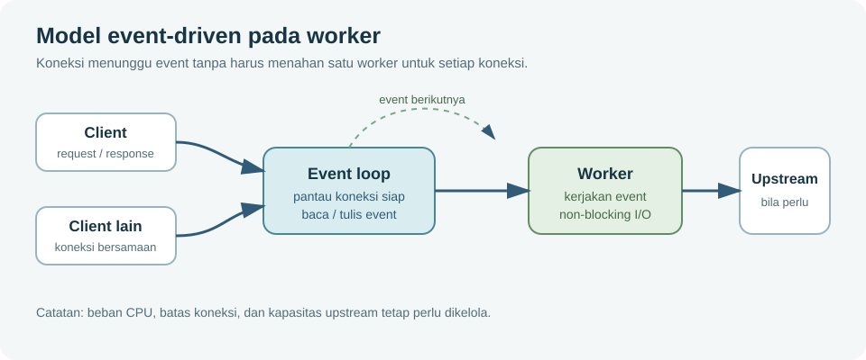

**Gambar 1.** Alur event-driven pada worker web server.

### 2. Arsitektur Apache vs Nginx

Apache HTTP Server menggunakan Multi-Processing Module (MPM), misalnya `prefork`, `worker`, atau `event`, untuk menentukan bagaimana proses dan thread menangani koneksi. Karena itu, karakteristik Apache tidak tepat diringkas sebagai selalu satu proses per request. Nginx menggunakan proses master dan worker; worker memanfaatkan event loop untuk menangani banyak koneksi secara asynchronous.

Keduanya mampu menyajikan konten statis dan menjadi reverse proxy. Pilihan ditentukan oleh kebutuhan aplikasi, modul, konfigurasi, kompatibilitas, dan hasil pengujian beban. Contoh laboratorium yang berguna adalah menempatkan Nginx pada lapisan depan untuk routing, lalu meneruskan request ke Apache atau aplikasi di jaringan internal.

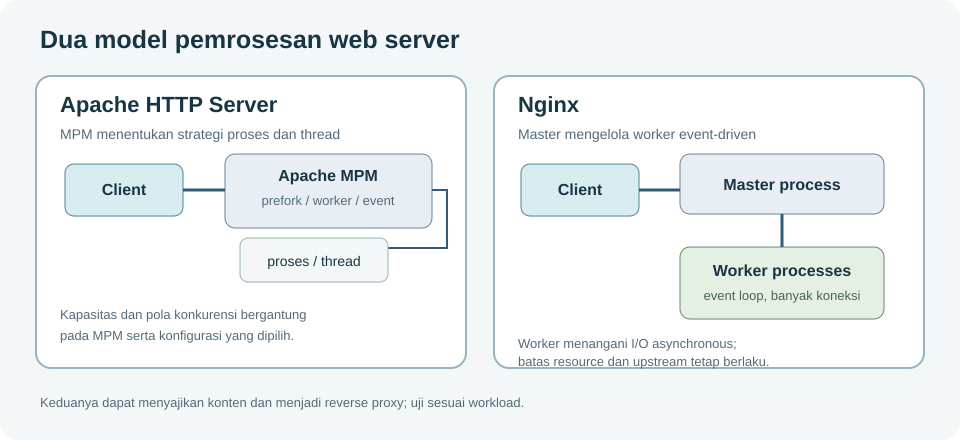

**Gambar 2.** Perbandingan model pemrosesan; implementasi Apache bergantung pada MPM yang dipilih.

### 3. HTTP Routing dan Trusted Header

Reverse proxy dapat memilih upstream berdasarkan hostname dan path. Sebagai contoh, `/` dapat diarahkan ke web Apache, sedangkan `/api/` diarahkan ke layanan API. Proxy meneruskan informasi yang diperlukan backend, seperti host asli dan skema koneksi. Header umum meliputi `Host`, `X-Forwarded-For`, dan `X-Forwarded-Proto`.

Header tersebut bukan bukti identitas yang berdiri sendiri. Proxy tepercaya harus menghapus atau menimpa nilai kiriman client sebelum meneruskan request. Backend hanya boleh mempercayai forwarded header dari proxy yang dikenal, dan sebaiknya tidak dapat diakses langsung dari jaringan publik. Tanpa pembatasan itu, client dapat memalsukan alamat asal atau skema request, yang berisiko mengacaukan log, redirect, dan keputusan keamanan.

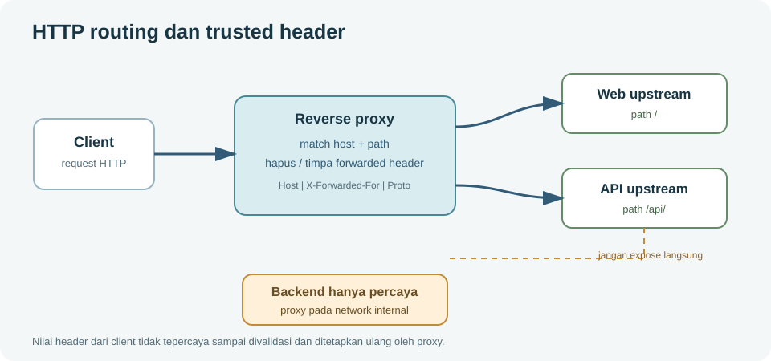

**Gambar 3.** Routing request dan batas kepercayaan header antara client, proxy, dan backend.

### 4. Dua Opsi TLS

TLS melindungi kerahasiaan dan integritas data selama transit serta memungkinkan client memeriksa identitas server. **Terminasi TLS di reverse proxy** berarti koneksi client ke proxy dienkripsi, lalu proxy meneruskan HTTP ke backend. Pola ini menyederhanakan pengelolaan sertifikat, tetapi segmen proxy-ke-backend tidak terenkripsi dan harus dibatasi pada jaringan yang sesuai.

**TLS passthrough** meneruskan koneksi TLS tanpa membuka isinya di proxy; handshake TLS berakhir di backend. Backend mengelola sertifikat dan routing pada lapisan TLS lebih terbatas. Pilihan lain yang umum adalah TLS re-encryption: proxy melakukan terminasi TLS lalu membuat koneksi TLS baru ke backend. Apa pun polanya, sertifikat harus sesuai hostname, private key dilindungi, dan masa berlaku dipantau. Sertifikat self-signed hanya sesuai untuk latihan, bukan layanan publik.

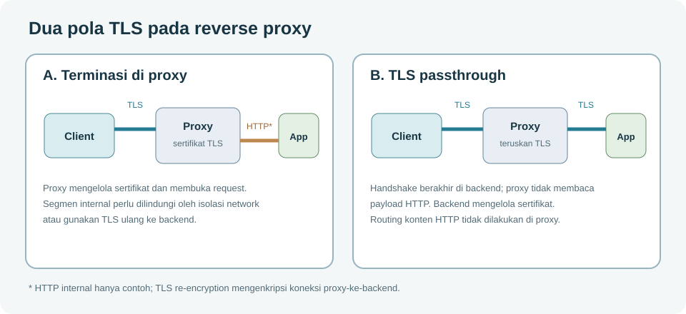

**Gambar 4.** Perbandingan lokasi terminasi handshake TLS.

### 5. Penyimpanan Private Key

Private key harus diperlakukan sebagai secret: jangan dimasukkan ke image container, repository kode, log, atau artefak build yang dapat diunduh. Pada deployment, key dapat diberikan melalui secret manager atau secret runtime platform. Untuk laboratorium, bind mount read-only dapat digunakan dengan permission file dan akses host yang dibatasi.

Hak baca diberikan hanya kepada proses yang memerlukan key. Rotasi harus mencakup penggantian material, reload layanan, pemeriksaan sertifikat baru, dan prosedur pemulihan. Mount read-only membantu mencegah perubahan dari container, tetapi tidak dengan sendirinya melindungi key dari pengguna host yang memiliki hak akses.

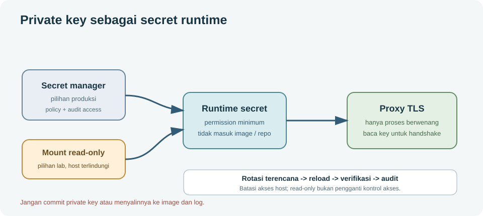

**Gambar 5.** Alur pemberian dan perlindungan private key saat runtime.

### 6. Liveness vs Readiness

Liveness menjawab apakah proses masih berjalan dengan benar. Jika pemeriksaan liveness gagal berulang kali, platform dapat memulai ulang container. Readiness menjawab apakah layanan siap menerima trafik. Jika readiness gagal, endpoint dikeluarkan sementara dari routing tanpa harus memulai ulang proses.

Keduanya tidak boleh disamakan dengan status container `running`. Pemeriksaan sebaiknya mewakili kondisi layanan yang relevan dan memiliki timeout serta ambang kegagalan yang masuk akal. Readiness dapat memeriksa dependency yang benar-benar dibutuhkan untuk melayani request; hindari menjadikan setiap gangguan dependency sementara sebagai alasan restart berulang.

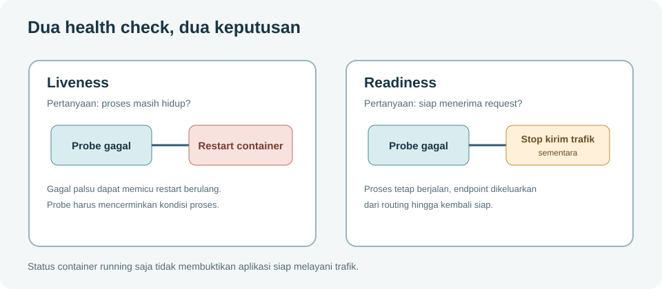

**Gambar 6.** Dampak kegagalan liveness dan readiness yang berbeda.

### 7. Governance dan Config as Code

Konfigurasi web server merupakan bagian dari sistem yang harus ditinjau dan diuji. Simpan konfigurasi di version control, lakukan review perubahan, validasi sintaks dengan tool server yang sesuai, dan uji routing serta perilaku gagal sebelum deployment. Perubahan yang sudah dirilis perlu dapat ditelusuri ke commit, pemilik, lingkungan, dan hasil pemeriksaannya.

Gunakan konfigurasi terkontrol untuk membatasi port yang dipublikasikan, menetapkan upstream dan timeout, mengatur header, serta menunjuk lokasi sertifikat atau secret tanpa menyimpan private key di repository. Setelah deployment, pantau status, log, dan metrik. Siapkan rollback ke versi konfigurasi yang diketahui baik, lalu catat hasil dan pengecualian kebijakan.

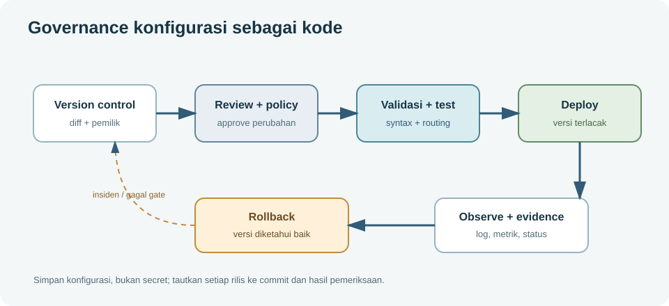

**Gambar 7.** Siklus config as code untuk perubahan web service yang dapat ditelusuri.


## Laporan Praktikum

### Tujuan dan Arsitektur

Praktikum membangun tiga layanan: Nginx sebagai reverse proxy, Apache sebagai web server statis, dan Flask sebagai API. Client hanya mengakses Nginx melalui port host `8080` (HTTP) atau `8443` (HTTPS). Nginx meneruskan `/` ke Apache dan `/api/` ke Flask melalui jaringan Compose. Backend tidak memiliki published port.

### 1. Membuat Direktori Kerja & Struktur Folder

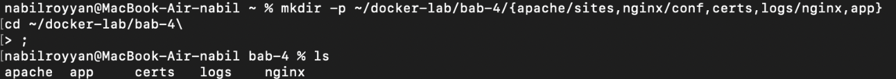
- Fungsi: Membuat struktur direktori tempat menyimpan seluruh
konfigurasi proyek sekaligus. Opsi -p membuat folder induk (parent)
jika belum ada.
- Hasil: Dibuat folder apache/sites, nginx/conf, certs, logs/nginx, dan
app di dalam ~/docker-lab/bab-4/.

### 2. Membuat Sertifikat TLS (HTTPS)

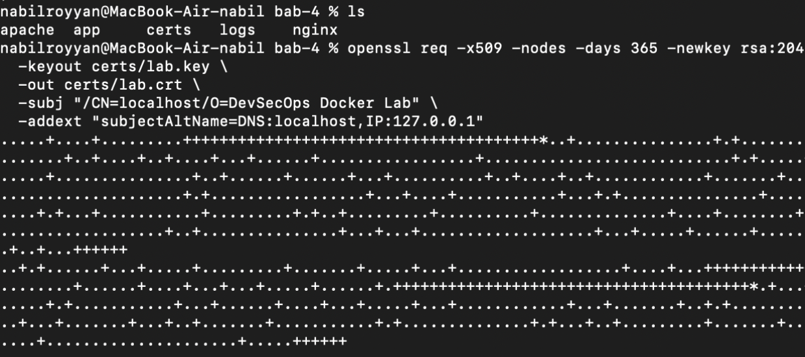
Fungsi: Membuat sertifikat SSL/TLS self-signed mandiri untuk enkripsi
HTTPS local.
- x509: Menghasilkan sertifikat yang ditandatangani sendiri (bukan
CSR ke CA resmi).
- nodes: Kunci privat tidak diproteksi password (agar container Nginx
bisa membacanya otomatis saat startup).
- days 365: Masa berlaku sertifikat 1 tahun.
- newkey rsa:2048: Membuat private key RSA 2048-bit baru.
- keyout certs/lab.key: Output file kunci privat.
- out certs/lab.crt: Output file sertifikat publik.
- subj: Menentukan nama identitas domain (localhost) dan organisasi.
- addext "subjectAltName...": Menambahkan domain/IP cadangan agar
browser/curl tidak menganggap sertifikat tidak valid secara nama.

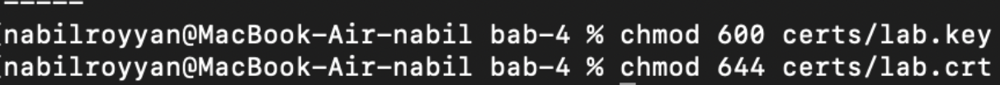
Fungsi (Hardening Akses File):
- 600 pada lab.key: Kunci privat hanya boleh dibaca dan ditulis oleh
pemilik file (mencegah kebocoran kunci).
- 644 pada lab.crt: Sertifikat publik boleh dibaca oleh siapa saja/process
di container.

### 3. Membuat File Konfigurasi Orchestration di laman compose.yaml

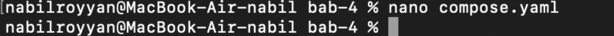
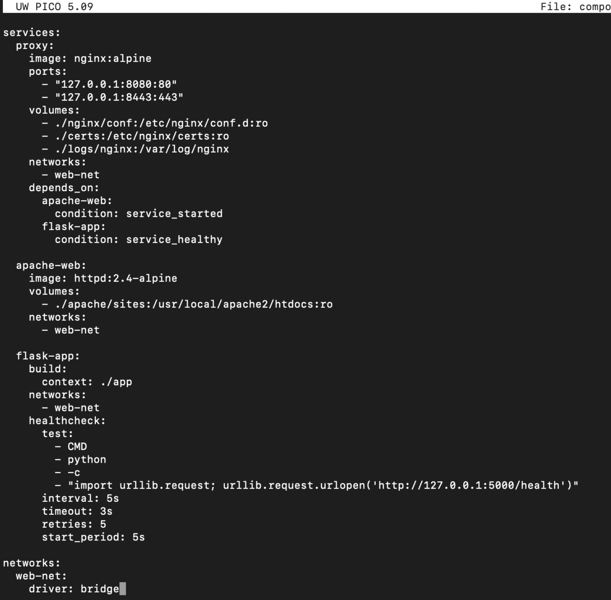

Fungsi: Membuka text editor nano untuk menulis definisi 3 layanan
container (proxy, apache-web, flask-app) dan jaringannya (web-net).
Inti file compose.yaml:
- proxy: Nginx mempublikasikan port 8080 (HTTP) & 8443
(HTTPS) ke host local.
- apache-web & flask-app: Tidak membuka port ke host
local, hanya bisa diakses via Nginx lewat jaringan internal
web-net.
- healthcheck: Memastikan Flask benar-benar siap
menerima traffic via endpoint /health sebelum Nginx
menganggapnya online.

### 4. Membuat Berkas Konfigurasi Aplikasi & Service

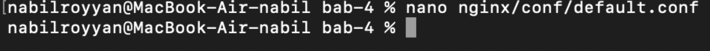
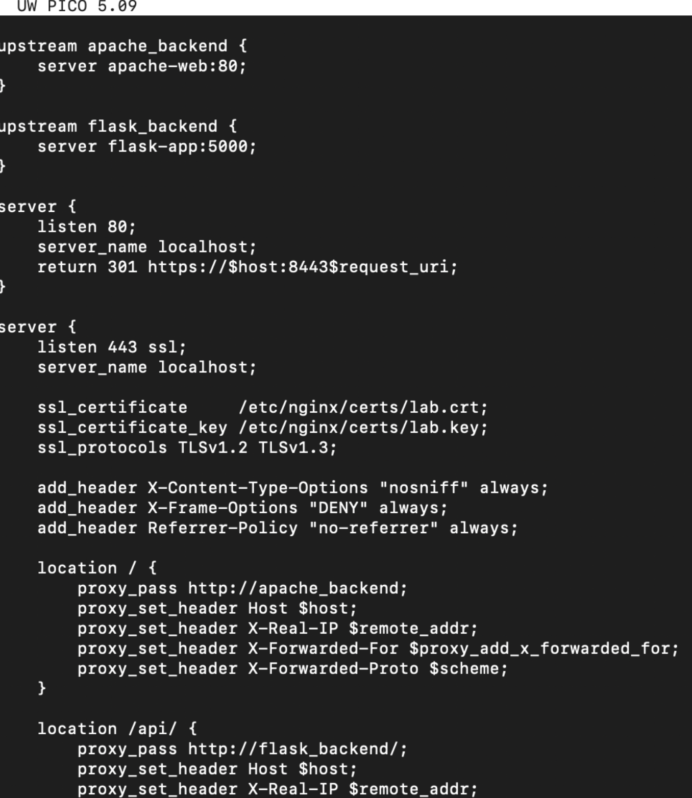

Fungsi: Menulis aturan Reverse Proxy Nginx. Menangani pengalihan dari
HTTP ke HTTPS (301 redirect), TLS termination, menambahkan header
keamanan (X-Frame-Options, dll.), serta membagi rute:
- Traffic / diarahkan ke Apache.
- Traffic /api/ diarahkan ke Flask App.

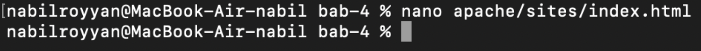
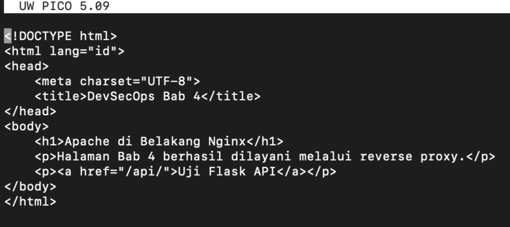

Fungsi: Membuat halaman web statis HTML sederhana yang dilayani
oleh Apache.

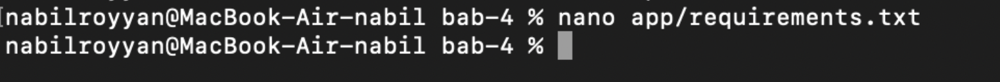
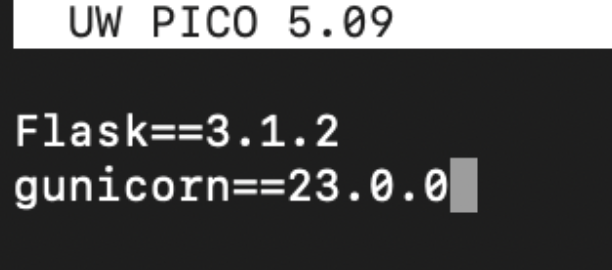

Fungsi: Menentukan pustaka Python yang dibutuhkan oleh aplikasi API
(Flask dan production WSGI server gunicorn).

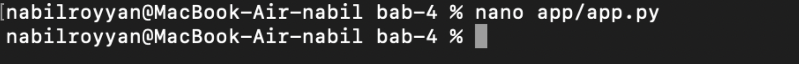
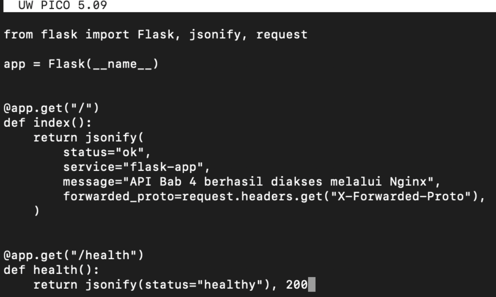

Fungsi: Menulis kode aplikasi REST API berbasis Flask dengan
endpoint / (JSON info) dan /health (pengecekan kesehatan).

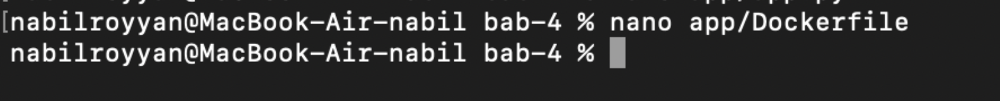
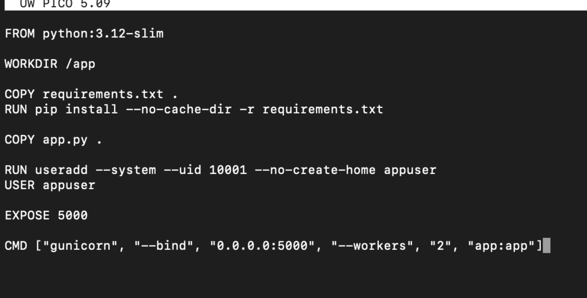

Fungsi: Resep build image Docker untuk Flask. Menggunakan base
image python:3.12-slim, menginstal dependency, dan menerapkan
praktik keamanan Non-Root User (USER appuser dengan UID 10001).

### 5. Validasi Konfigurasi

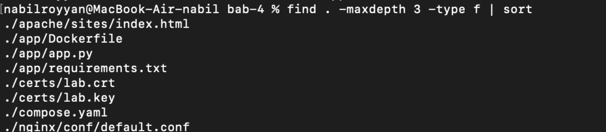

Fungsi: Menampilkan seluruh daftar berkas yang telah dibuat hingga
kedalaman 3 subfolder secara terurut untuk memastikan tidak ada berkas yang
kelewatan/salah posisi.

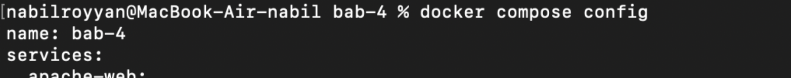

Fungsi: Memeriksa sintaks dan validitas isi file compose.yaml. Jika tidak ada
galat, Docker Compose akan menampilkan hasil resolusi konfigurasi akhir

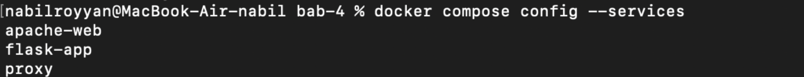

Fungsi: Menampilkan hanya nama-nama service yang terdefinisi di
compose.yaml (proxy, apache-web, flask-app).

### 6. Membangun & Menjalankan Stack Container

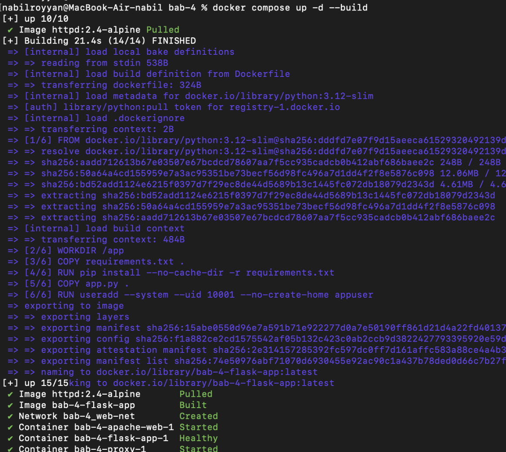

Fungsi:
- --build: Membangun ulang Docker image (terutama untuk flask-app
yang memiliki Dockerfile).
- -d (detached mode): Menjalankan seluruh container di background.

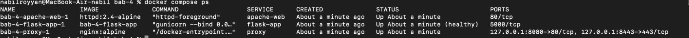

Fungsi: Memeriksa status kontainer yang sedang berjalan (apakah Up,
Healthy, atau Exited).

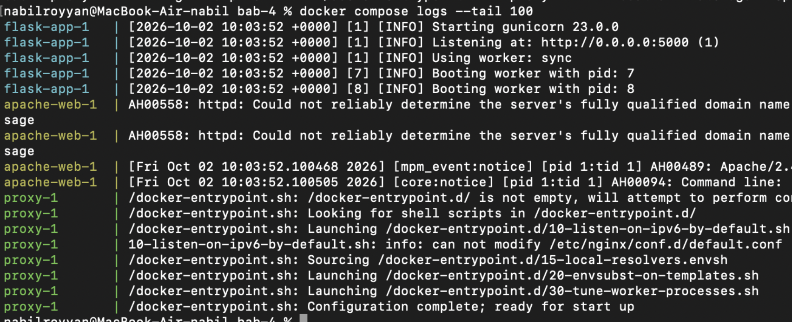

Fungsi: Menampilkan 100 baris log terakhir dari seluruh container untuk
melihat proses startup atau mengecek apakah ada galat.

### 7. Pengujian Aplikasi via Endpoint

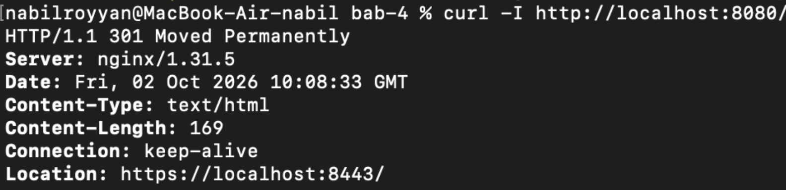

Fungsi: Menguji response header HTTP (port 8080). Dipastikan
mengembalikan status 301 Moved Permanently yang mengarahkan ke
HTTPS (https://localhost:8443/).

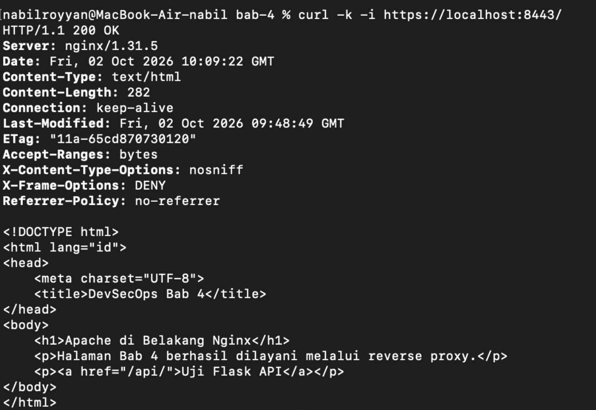

Fungsi: Mengakses halaman utama HTTPS (port 8443). Opsi -k
mengabaikan peringatan sertifikat self-signed, dan -i menampilkan
header HTTP. Harusnya menampilkan halaman HTML dari Apache.

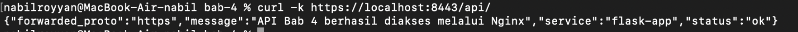

Fungsi: Menguji akses ke endpoint API Flask melalui Nginx (/api/).
Mengembalikan data berformat JSON.

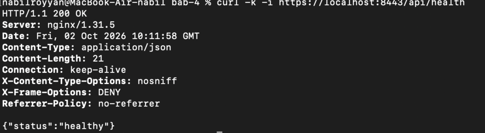

Fungsi: Menguji endpoint kesehatan Flask API melalui Nginx. Dipastikan
mengembalikan status 200 OK dengan JSON {"status": "healthy"}.

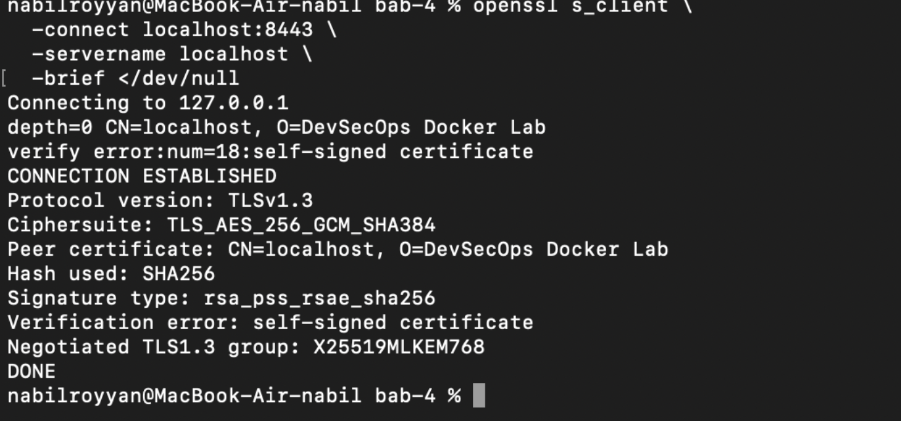

Fungsi: Memeriksa detail negosiasi TLS/SSL pada port 8443 (melihat versi
protokol TLS yang disepakati dan informasi sertifikat).

### 8. Pemeriksaan Isolasi Jaringan

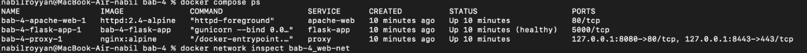

Fungsi: Memastikan daftar kontainer aktif beserta port yang terpublikasi
(hanya Nginx yang punya ikatan port host).

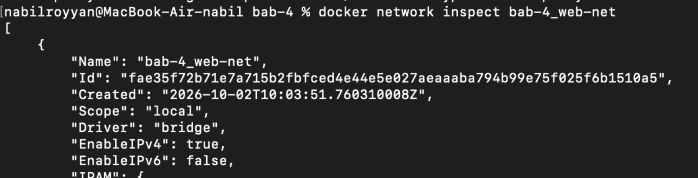

Fungsi: Memeriksa konfigurasi detail jaringan internal Docker (web-net),
termasuk daftar IP internal yang didapat oleh masing-masing container.

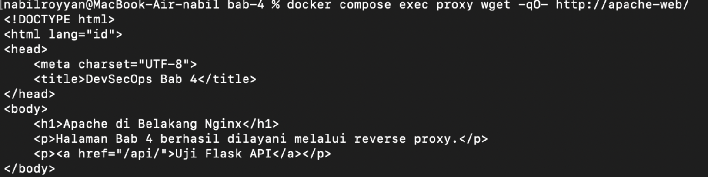

Fungsi: Menjalankan perintah wget dari dalam container proxy ke container
apache-web secara internal untuk membuktikan antar-container bisa saling
berkomunikasi di dalam jaringan web-net.

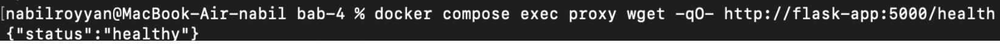

Fungsi: Membuktikan container Nginx bisa mengakses endpoint healthcheck
flask-app di port internal 5000.

### 9. Pemeriksaan Log

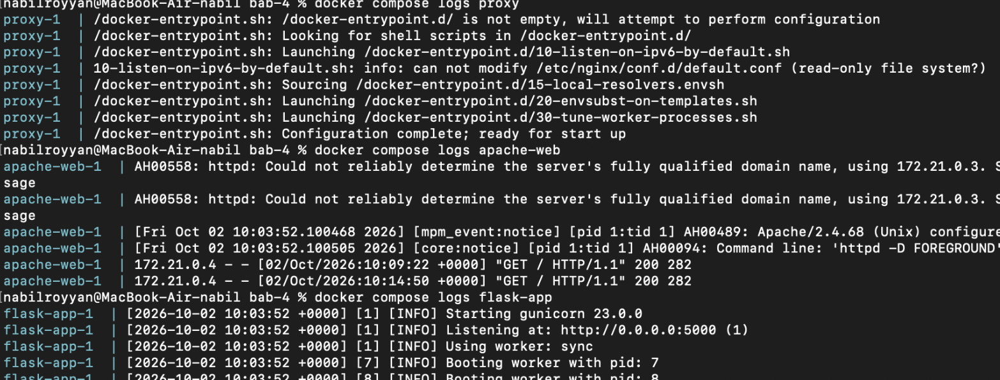

Fungsi: Memeriksa log aplikasi dari masing-masing container secara spesifik.

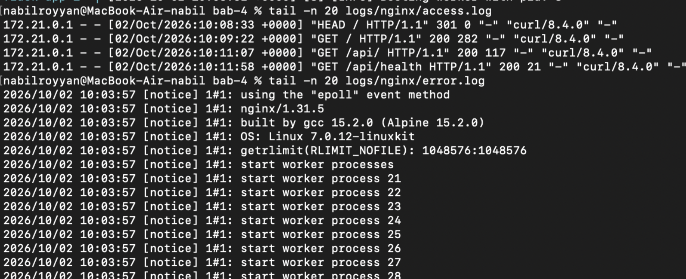

Fungsi: Melihat 20 baris terakhir log akses dan log error Nginx yang disimpan
di direktori host (karena di-mount via volume).

### 10. Cleanup (Pembersihan Lingkungan)

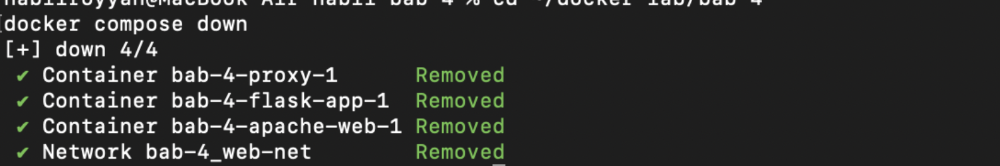

Fungsi: Menghentikan dan menghapus seluruh container, network, dan
volume yang dibuat oleh file Compose ini.

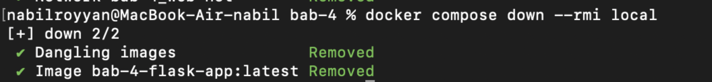

Fungsi: Menghentikan stack container sekaligus menghapus Docker image
lokal yang dibuat dari hasil build (image Flask).


### 8. Hasil Uji Penerimaan

| Pemeriksaan | Hasil pada laporan |
| --- | --- |
| `docker compose config` valid | Lulus |
| Flask berstatus healthy | Lulus |
| HTTP port 8080 redirect ke HTTPS | Lulus, status 301 |
| HTTPS port 8443 menyajikan halaman Apache | Lulus, status 200 |
| `/api/` diarahkan ke Flask dan menghasilkan JSON | Lulus |
| Negosiasi TLS 1.2 atau 1.3 | Lulus, TLS 1.3 tercatat |
| Backend tidak memiliki published port | Lulus |
| Request tercatat di access log Nginx | Lulus |

### 9. Analisis dan Evaluasi

**Mengapa reverse proxy tidak menjalankan seluruh logika aplikasi?** Proxy dan aplikasi memiliki tanggung jawab serta kebutuhan resource berbeda. Pemisahan memungkinkan routing, TLS, logging, dan kebijakan koneksi dikelola di proxy, sementara logika bisnis serta validasi tetap di aplikasi. Keduanya juga dapat diperbarui dan diskalakan secara terpisah.

**Apa perbedaan TLS termination dan end-to-end TLS?** Pada konfigurasi praktikum, TLS berakhir di Nginx lalu koneksi Nginx-ke-backend menggunakan HTTP pada network Compose. Pada end-to-end TLS, koneksi dari proxy ke backend juga dilindungi TLS (TLS re-encryption), atau TLS diteruskan tanpa terminasi di proxy (passthrough). Pilihan bergantung pada threat model dan kebutuhan inspeksi/routing.

**Bagaimana backend diisolasi dari akses host langsung?** Jangan deklarasikan `ports` pada service backend, tempatkan service pada network Compose yang sama, dan publikasikan hanya port proxy. Bind port proxy ke `127.0.0.1` untuk akses lokal. Untuk pembatasan yang lebih kuat, evaluasi opsi network internal dan aturan egress sesuai kebutuhan.

**Apa risiko private key pada bind mount?** Permission host yang longgar atau host yang terkompromi dapat membocorkan key. Kompromi container proxy juga memberi penyerang kesempatan membaca key yang dipakai proses. UID/GID yang tidak sesuai dapat membuat service gagal membaca file. Mitigasi lab: permission `600`, mount read-only, dan akses host terbatas; untuk produksi gunakan secret manager atau mekanisme secret runtime yang terkontrol.

| Aspek | Log Nginx (proxy) | Log Apache (backend) |
| --- | --- | --- |
| Perspektif | Request dari client dan keputusan proxy | Request yang diteruskan ke origin |
| Informasi client | Dapat melihat peer client; forwarded chain perlu trust yang benar | Umumnya melihat IP proxy sebagai peer kecuali dikonfigurasi untuk memproses header tepercaya |
| Fokus troubleshooting | TLS, redirect, routing, timeout, dan `502 Bad Gateway` | Status aplikasi/konten seperti `404` atau `500` |

### 10. Pembersihan Lingkungan

Setelah bukti dikumpulkan, stack dihentikan dan resource Compose dibersihkan.

```bash
docker compose down
docker compose down --rmi local
```

Perintah `down` menghapus container dan network Compose; `--rmi local` juga menghapus image lokal yang dibangun proyek. Bind mount seperti sertifikat, konfigurasi, dan log tetap berada di direktori kerja. Jika menambahkan named volume pada konfigurasi lain, penghapusannya perlu dilakukan secara sadar karena volume dapat berisi data yang masih diperlukan.

## Rangkuman

Apache dan Nginx menawarkan model pemrosesan dan pilihan konfigurasi yang berbeda, tetapi keduanya dapat digunakan untuk menyajikan konten maupun sebagai proxy. Desain yang baik menempatkan routing dan trust boundary secara eksplisit, memilih pola TLS sesuai kebutuhan perlindungan antarsegmen, serta menjaga private key sebagai secret runtime. Health check harus membedakan proses hidup dari kesiapan menerima trafik. Seluruh konfigurasi perlu dikelola melalui version control, review, pengujian, observasi, dan rollback.
